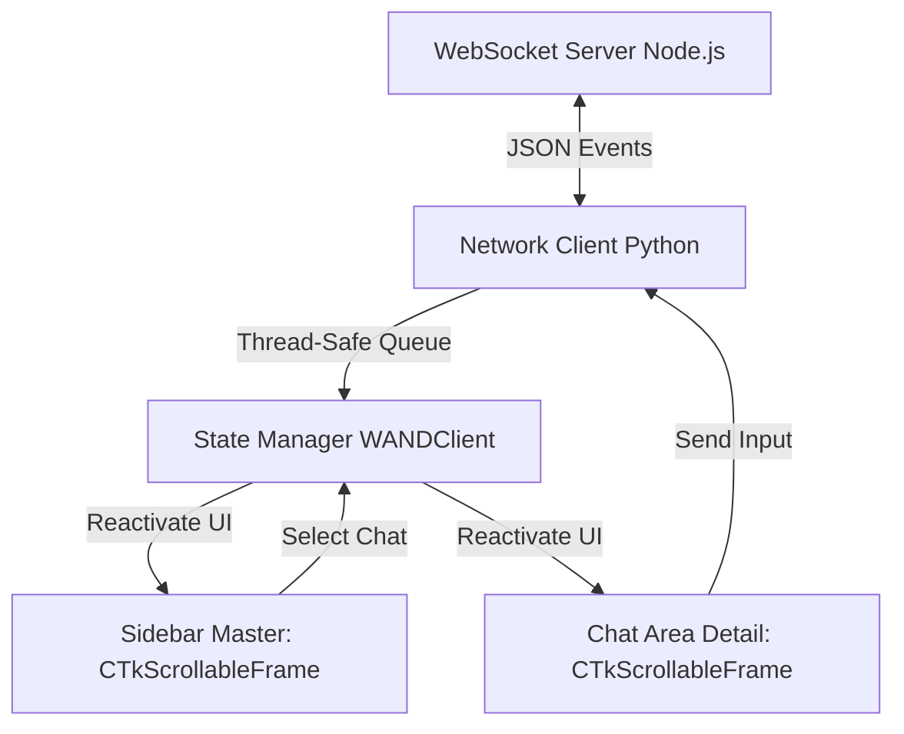

# 🎨 Especificação de Design Técnico: Sidebar Master-Detail (Fase 4.1)
**Projeto:** W.A.N.D. (WhatsApp Notification Devices)  
**Autor:** Tech Leader Senior (Mestre Python Pro)  
**Data:** Maio de 2026  

---

## 1. Visão Geral da Arquitetura
A Fase 4.1 migrará a janela atual do cliente Python de um histórico simples e vertical de mensagens para uma **Interface Master-Detail (Duas Colunas)** robusta e de alta performance. 

Esta mudança transforma o W.A.N.D. Client em uma aplicação de chat completa e moderna, sem perder a leveza e a resiliência garantidas nas fases anteriores.



---

## 2. Protocolo de Comunicação WebSocket (Mudanças no Servidor)
Para viabilizar a listagem de chats e o histórico individual de cada contato, estenderemos o protocolo de comunicação no servidor Node.js.

### 2.1. Obter Lista de Chats (`get_chats`)
* **Requisição (Python -> Node):**
  ```json
  {
    "command": "get_chats",
    "data": {}
  }
  ```
* **Resposta (Node -> Python):**
  ```json
  {
    "type": "chats",
    "data": [
      {
        "jid": "5511999999999@s.whatsapp.net",
        "name": "Maria Silva",
        "unreadCount": 2,
        "lastMessage": {
          "text": "Olá, tudo bem?",
          "timestamp": 1715978250000,
          "fromMe": false
        }
      }
    ]
  }
  ```

### 2.2. Obter Histórico de um Chat Específico (`get_chat_history`)
* **Requisição (Python -> Node):**
  ```json
  {
    "command": "get_chat_history",
    "data": {
      "jid": "5511999999999@s.whatsapp.net",
      "limit": 50
    }
  }
  ```
* **Resposta (Node -> Python):**
  ```json
  {
    "type": "chat_history",
    "data": {
      "jid": "5511999999999@s.whatsapp.net",
      "messages": [
        {
          "senderName": "Maria Silva",
          "text": "Olá, tudo bem?",
          "timestamp": 1715978250000,
          "fromMe": false
        },
        {
          "senderName": "Você",
          "text": "Tudo ótimo, e com você?",
          "timestamp": 1715978280000,
          "fromMe": true
        }
      ]
    }
  }
  ```

---

## 3. Design da UI CustomTkinter (Duas Colunas)
Substituiremos a estrutura de `self.main_container` dentro de `HistoryWindow` de um layout vertical de coluna única para um layout flexível baseado em Grid.

### 3.1. Grid Layout da Janela Principal
A área central (Row 1) do `main_container` será dividida em duas colunas:

| Coluna 0: Sidebar (Master) [Peso: 0] | Coluna 1: Área de Chat (Detail) [Peso: 1] |
| :--- | :--- |
| **Largura Fixa:** `200px` a `240px` | **Largura Flexível:** Ocupa todo o espaço restante |
| **Cor de Fundo:** `#EFEFF4` (estilo Apple Sidebar) | **Cor de Fundo:** `#F5F5F7` (cinza de contraste) |

---

### 3.2. Protótipo Visual da Interface
```
+-------------------------------------------------------------------------------+
| W.A.N.D. - Dashboard                                        [ - ] [ ▣ ] [ ✕ ] |
+------------------------------------+------------------------------------------+
|  CONVERSAS                         |  Maria Silva   (5511999999999)           |
|  +------------------------------+  |  +------------------------------------+  |
|  | João Santos              14:30 |  |  | [14:28] Maria Silva              |  |
|  | Fala cara! Tudo bem?           |  |  | Oi! Você viu as métricas hoje?   |  |
|  +------------------------------+  |  | +----------------------------------+  |
|  | Maria Silva [2]          14:28 |  |                                        |  |
|  | Oi! Você viu as métric...      |  |             +------------------------+ |
|  +------------------------------+  |             | Você            [14:29]  | |
|  | Grupo Devs               12:15 |  |             | Sim! Ficaram ótimas.   | |
|  | Rodrigo: PR aprovado!          |  |             +------------------------+ |
|  +------------------------------+  |  +------------------------------------+  |
|                                    |  | [ Escreva sua mensagem...     ] [ENVIAR]|
+------------------------------------+------------------------------------------+
| W.A.N.D. v2.1 - Conectado                                                     |
+-------------------------------------------------------------------------------+
```

### 3.3. Elementos Gráficos e Estilos
* **Sidebar (Master):**
  * `CTkScrollableFrame` que abriga cards horizontais interativos.
  * Cada card possui bordas arredondadas (`corner_radius=8`), fundo branco `#FFFFFF` e realce visual (hover) elegante.
  * Ao selecionar o card, aplicaremos um contorno de destaque ou fundo cinza claro para indicar ativação.
  * Badge vermelho discreto de mensagens não lidas (`unreadCount`).
* **Área de Chat (Detail):**
  * **Painel Superior:** Identificação clara do contato ativo (Nome amigável + JID formatado).
  * **Corpo do Chat:** `CTkScrollableFrame` dedicado.
    * Mensagens recebidas alinhadas à esquerda (`anchor="w"`) com fundo cinza/verde claro.
    * Mensagens enviadas alinhadas à direita (`anchor="e"`) com fundo azul-claro ou verde WhatsApp clássico.
  * **Painel Inferior (Barra de Digitação):**
    * Um `CTkEntry` expandido no rodapé da área de chat com cantos arredondados (`corner_radius=20`).
    * Botão "Enviar" acoplado de forma fluida para despachar mensagens com atalho natural por tecla `Enter`.

---

## 4. Gerenciamento de Estado Reativo (Python Pro)
Seguindo os preceitos de modularidade e desacoplamento da skill `python-pro`, a lógica de negócios e dados será mantida isolada da lógica geométrica do Tkinter.

### 4.1. Estruturas de Dados do Cliente
Criaremos um estado estruturado dentro de `WANDClient` (em `main.py`):
```python
from typing import Dict, List, Any, Optional

class WANDClient:
    def __init__(self):
        # ... inicializações existentes ...
        
        # --- ESTADO APLICATIVO ---
        self.chats: List[Dict[str, Any]] = []               # Lista de chats ordenada
        self.messages_by_chat: Dict[str, List[Dict]] = {}   # Cache local: JID -> List[Mensagens]
        self.selected_jid: Optional[str] = None             # JID atualmente selecionado na UI
```

### 4.2. Fluxo Reativo de Dados (I/O Não Bloqueante)
1. **Conexão Estabelecida:** O cliente envia `get_chats` para inicializar a sidebar.
2. **Recebimento de Chats:** O WebSocket repassa o evento `chats` para a fila thread-safe `msg_queue`. A thread principal lê o JSON e chama `self.history_window.update_chats(chats)`.
3. **Seleção de Chat:** O usuário clica em um contato na sidebar.
   * A UI limpa a área de chat e exibe um estado de carregamento rápido.
   * Se já existirem mensagens no cache `self.messages_by_chat[jid]`, elas são renderizadas imediatamente.
   * Dispara um `get_chat_history` em background para atualizar o histórico.
4. **Recebimento de Mensagem em Tempo Real:**
   * A mensagem chega via WebSocket.
   * Identificamos a quem pertence a mensagem (`remoteJid`).
   * Adicionamos a mensagem ao cache local daquela conversa.
   * Se o JID da mensagem for o selecionado no momento, adicionamos o card dinamicamente no final do chat e forçamos a rolagem para baixo (`moveto(1.0)`).
   * Atualizamos a sidebar para trazer a conversa para o topo e redefinir a última mensagem e contador de não lidas.

---

## 5. Práticas Python Pro Aplicadas
1. **Desacoplamento e Baixo Acoplamento:** A `HistoryWindow` será a responsável por gerenciar a renderização de acordo com o estado fornecido pelo `WANDClient`. A UI não acessa o socket diretamente; ela aciona callbacks (`on_chat_selected`, `on_send_message`) passados na inicialização.
2. **Otimização de Renderização:** Em vez de destruir e reconstruir toda a tela a cada nova mensagem, o sistema inserirá componentes pontuais usando referências dinâmicas, mantendo a performance da aplicação no Windows acima de 60 FPS.
3. **Robustez Concorrente:** As mensagens e atualizações de estado do Baileys continuam transitando pela fila thread-safe `queue.Queue()`, prevenindo condições de corrida na interface visual do CustomTkinter.
